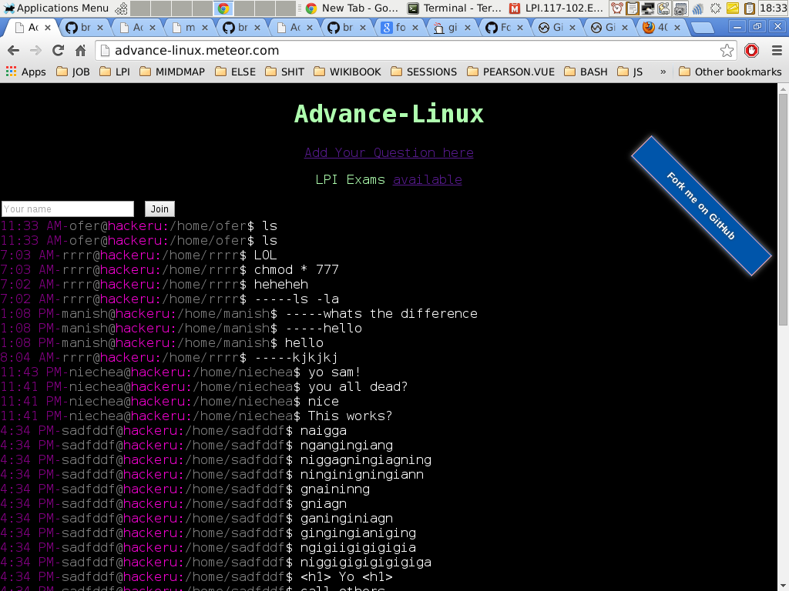

meteor-chat-tts
==

Features:
-----
- working text-to-speech chat
- nice linux prompt

Note
==
- open your speaker 
- log-in using 2 different users 
- start talking to yourself (for a limited time)

resources:
--
- https://github.com/zquestz/simplechat
- http://codepen.io/gabrieldamon42/pen/BCJsf
- https://github.com/search?l=Shell&o=desc&q=chat&ref=advsearch&s=stars&type=Repositories
